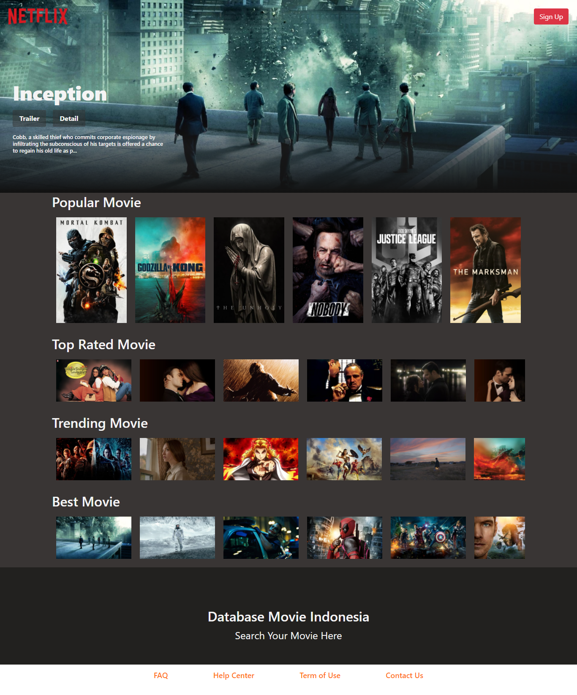
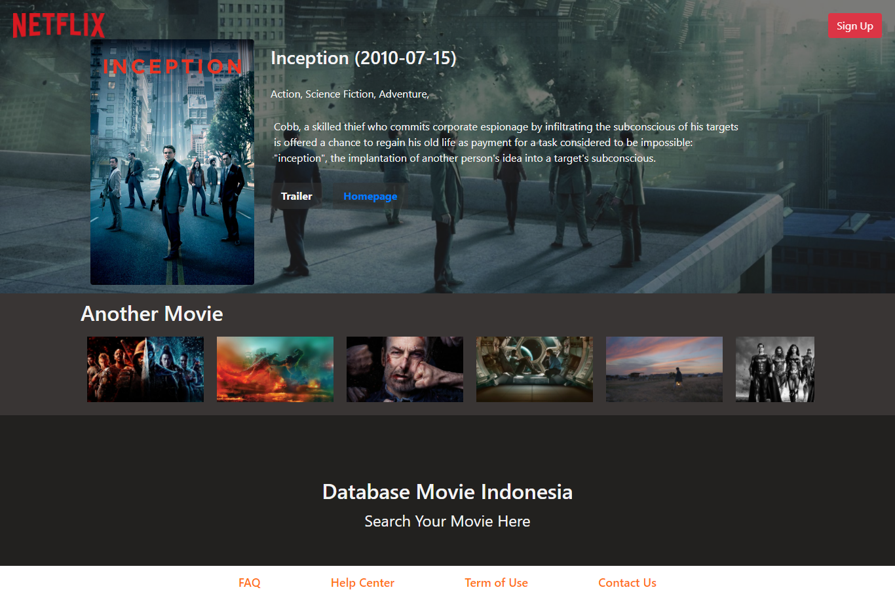
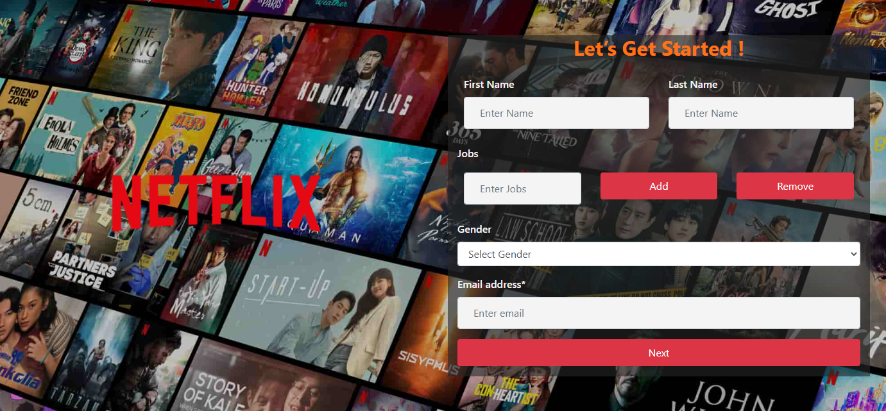

# DBID

<div align="center">
    
</div>

## Contents

- [Description](#description)
- [Screenshoots](#screenshoots)
- [Requirements](#requirements)
- [Installation](#installation)
- [ENV](#ENV)
- [Usage](#Usage)
- [Credit](#Credit)
- [License](#license)

## Description

**DBID** is a web all about movie.

## Screenshoots

<div align="center">
    
    
    
</div>

### Requirements

- [`Node Js`](https://nodejs.org/en/)
- [`npm`](https://www.npmjs.com/get-npm)
- [`ReactJs`](https://reactjs.org/)
- [`TMDB API`](https://developers.themoviedb.org/3)

### Installation

1. Clone the repo
   ```sh
   git clone https://github.com/bayue48/DBID.git
   ```
2. Install NPM packages
   ```sh
   npm install
   ```
   This will install the dependencies inside `node_modules`

### ENV

Please create and make the changes in the .env file.

```bash
REACT_APP_API = "https://api.themoviedb.org/3/"
REACT_APP_KEY = "Your TMDB API KEY"
```

### Usage

Runs the app in the development mode.

`npm start`.

Then open [http://localhost:3000/](http://localhost:3000/) to view it in the browser.

If you want to build, type `npm run build`.

## Credit

- [`TMDB API`](https://developers.themoviedb.org/3)

<div align="center">
    
</div>

## License

Distributed under the [MIT](https://github.com/bayue48/DBID/blob/main/LICENSE) License.
